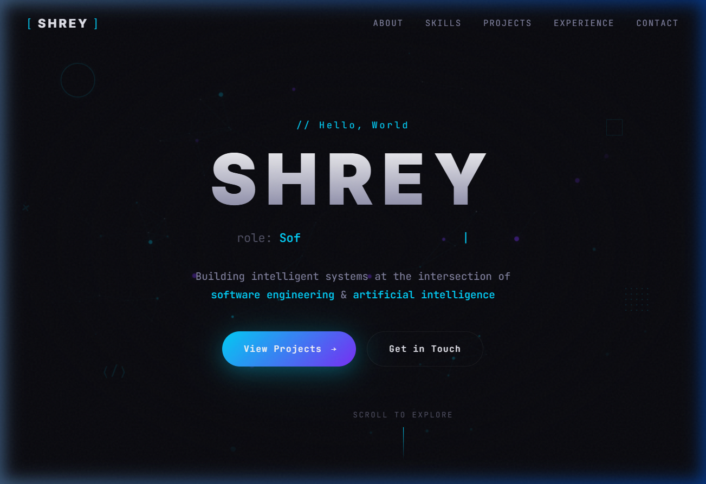
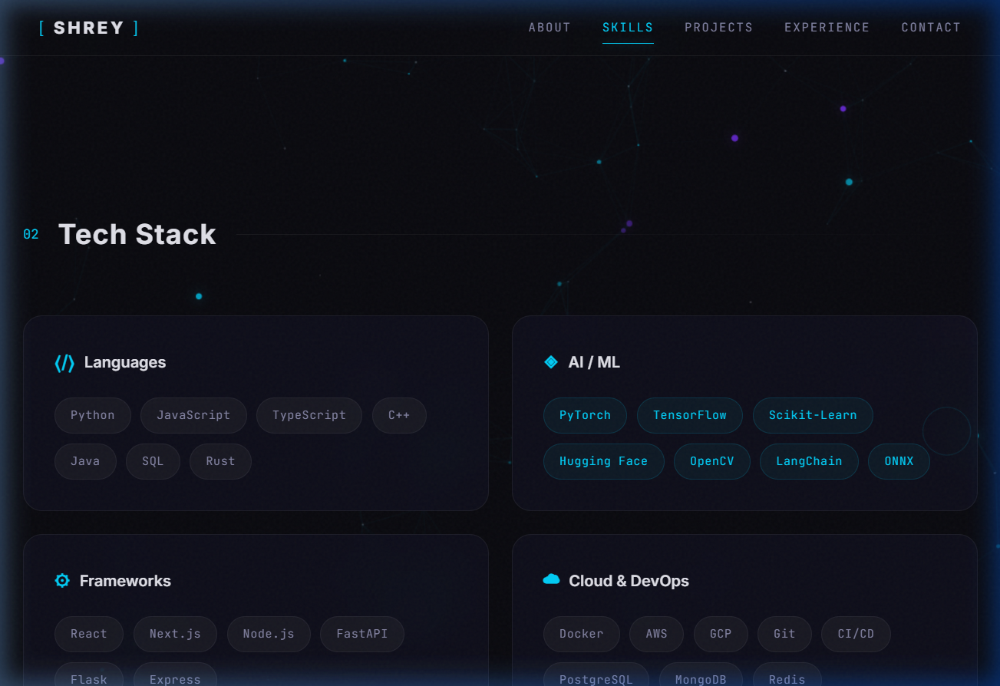
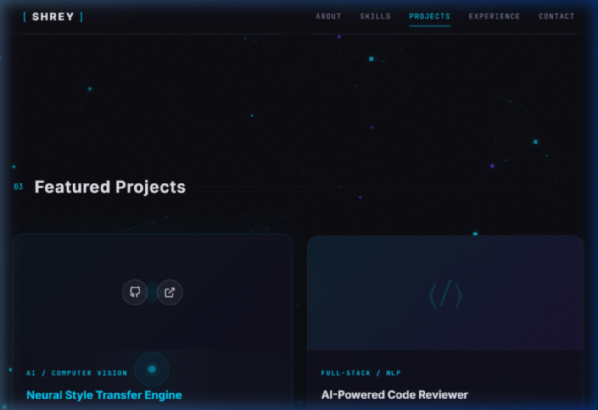
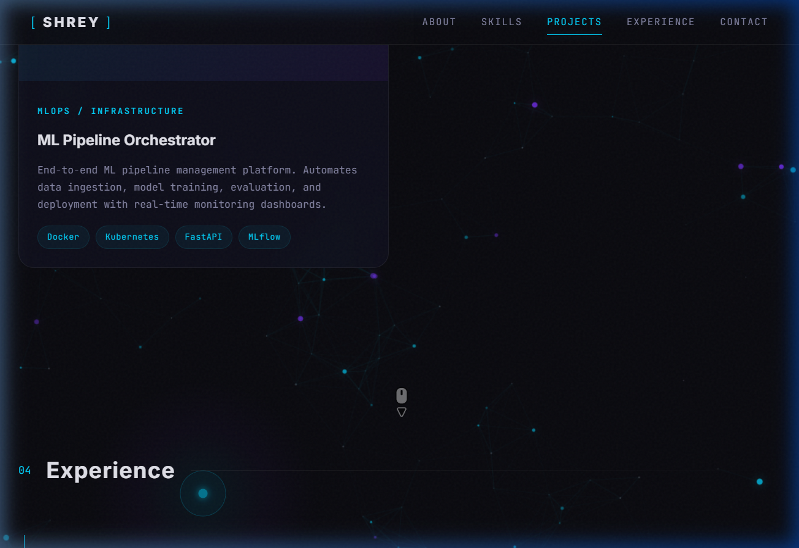

# Portfolio Website — Walkthrough

## What Was Built
A dark-themed, immersive portfolio website inspired by **igloo.inc** and **antigravity.google**, tailored for a Software Engineer & AI/ML Engineer. Features a fully interactive particle background with mouse-reactive physics, custom cursor, and rich micro-interactions.

**Stack**: Vite + Vanilla JS + CSS (no frameworks)

## Screenshots

### Hero Section
Full-page particle canvas with floating parallax shapes and custom glowing cursor:



### Skills Section
Staggered tag cascade reveals with 3D tilt on skill category cards:



### Projects Section
3D perspective tilt on hover with interactive particle network visible behind:



### Contact Section
Magnetic hover buttons and glowing social links:



## Key Design Features
- **Deep dark base** (`#0a0a0f`) with cyan/purple glow accents
- **JetBrains Mono** + **Inter** typography
- **Full-page interactive particle canvas** — covers entire site, not just hero
- **Mouse-repel physics** — particles push away from cursor with elastic spring-back
- **Custom glowing cursor** — cyan dot + outer ring with smooth lag animation
- **Floating parallax elements** — geometric shapes drifting across all sections
- **3D tilt on cards** — project cards, skill cards, and terminal tilt toward mouse
- **Magnetic hover buttons** — buttons pull toward cursor on hover
- **Staggered skill tag reveals** — tags cascade in one-by-one with 60ms delays
- **Section mouse glow** — subtle radial glow follows cursor in each section
- **Scroll-triggered reveals** via `IntersectionObserver`
- **Typing animation** cycling through roles
- **Glassmorphism** cards with `backdrop-filter: blur`
- **Elastic animated counters** with overshoot easing
- **Responsive** down to mobile with hamburger menu
- **Touch device fallback** — custom cursor and parallax shapes hidden on touch screens

## Files Modified

| File | Purpose |
|------|---------|
| `index.html` | HTML structure — added full-page canvas, cursor elements, parallax shapes |
| `src/style.css` | Design system — added cursor, parallax, glow, tilt, and animation styles |
| `src/main.js` | Interactive systems — particle field, cursor, parallax, magnetic, tilt |

## Running Locally
```
npm run dev
```
Dev server at **http://localhost:5173/**.
